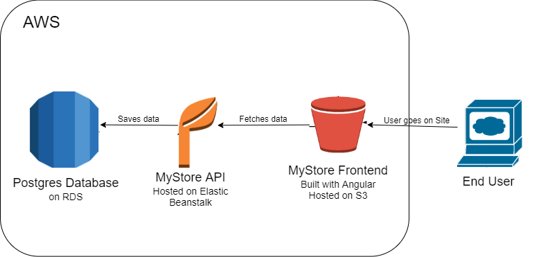

# MyStore

This is a fullstack project with Angular front end and express backend of a store. 
The user can register and login to their account, browse products in the store, add product to the cart, 
see the products in cart and delete them, and submit order. The project is deployed on AWS.

[Link to the frontend](http://mystore-114541.s3-website-us-east-1.amazonaws.com/)

[Link to the API](http://mystore-env.eba-3uctpvim.us-east-1.elasticbeanstalk.com/)

## Architecture

## Deployment
### S3
The frontend is deployed on S3.

### Elastic Beanstalk (EB)
The backend is deployed on EB.

### RDS
The postgres database is hosted on RDS.

### Circle CI
The deployment is done using a pipeline on CircleCI
![Circle CI status]
