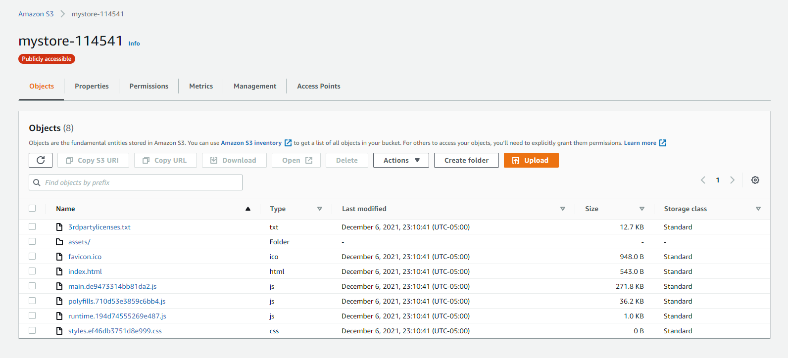
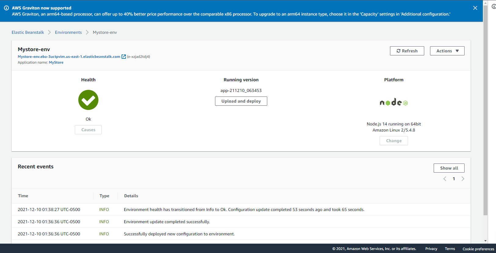
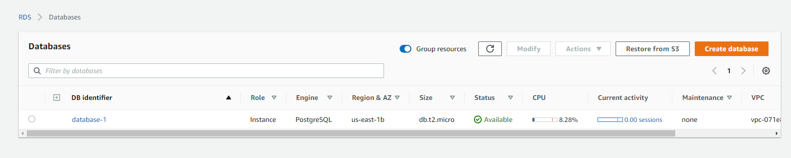

# Infrastructure Description
The application is hosted on AWS using:
1. S3
   The frontend is deployed on S3 with the static website hosting.
   
2. Elastic Beanstalk (EB)
   The backend is deployed on EB.
   
3. RDS
   The postgres database is hosted on RDS, including two databases for development and testing environment.
   