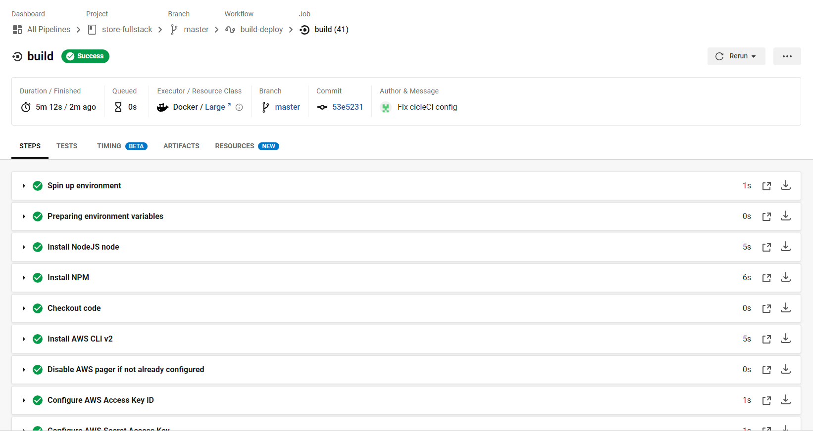

# Pipeline Process
The application is deployed with pipeline in [CircleCI](https://circleci.com/), the following environment variables 
are used.

| Key                   | Description                                                                                                 |
|-----------------------|-------------------------------------------------------------------------------------------------------------|
| AWS_DB_HOST           | The address where for the RDS database runs on                                                              |
| AWS_DB_NAME           | The name of the database in development environment                                                         |
| AWS_DB_TEST_NAME      | The name of the database in test environment                                                                |
| AWS_DB_USER           | The username of the user which has all privileges for the two databases                                     |
| AWS_DB_PASSWORD       | The password of the user                                                                                    |
| ENV                   | Working environment, set to "test"                                                                          |
| BCRYPT_PASSWORD       | The password used for encrypting passwords for the users                                                    |
| SALT_ROUNDS           | The hash rounds when encrypting passwords for the users                                                     |
| JWT_PASSWORD          | The secret for creating JSON Web Token                                                                      |
| AWS_ACCESS_KEY_ID     | The access key ID for the [IAM User](https://console.aws.amazon.com/iamv2) in AWS with Administrator Access |
| AWS_SECRET_ACCESS_KEY | The secret access key ID for the IAM User                                                                   |
| AWS_DEFAULT_REGION    | The AWS Region to send the request to                                                                       |



1. Install nodeJS and set up AWS CLI and EB
2. Install dependencies for frontend by going into the frontend folder and running ```npm install```
3. Install dependencies for backend by going into the backend folder and running ```npm install```
4. Migrate the database, first run ```npm i -g db-migrate db-migrate-pg``` to allow the ``db-migrate` command,
then run ```db-migrate up``` in the backend folder to set up the database
5. Test the backend by running ```npm run test``` in the backend folder, the script will first set up the test database,
then run jasmine to test the backend
6. Deploy the frontend by running ```aws s3 cp --recursive --acl public-read ./dist/MyStore s3://<bucket-name>``` 
in the frontend folder, where ```<backet-name>``` is the name of the s3 bucket to deploy the frontend
7. Deploy the backend by running ```eb deploy``` in the backend folder, make sure to run ```eb init``` before the first
deploy